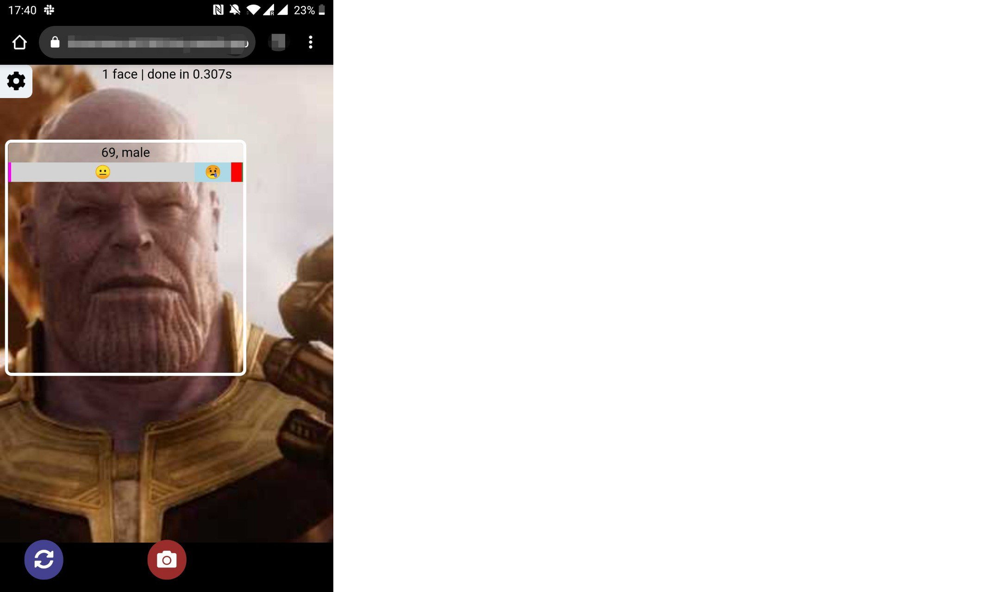

# Computer vision showcase

## Local setup

Make sure you have installed node.js, NPM and Yarn. After cloning this repo, install dependencies:

```sh
yarn
```

Then run the development server (it will start on [port 3000](http://localhost:3000) by default:

```sh
yarn start
```

## Usage

You can either open the [existing demo](https://computer-vision-showcase.vercel.app/) or build and run the app locally. Enable the camera on your device to use this app.




You can change some of the model's settings by clicking the ⚙️ button at the top of the screen:

* You can choose between clicking a button every time you want to process the image vs. automatic ("real-time") processing. If the device doesn't support WebGL with hardware acceleration, the NN will work much slower (5-20 seconds vs. 0.3-0.7 seconds per run), so the automatic mode is turned off by default on such devices.
* You can play with the algorithm's minimum score threshold if it either fails to detect the faces or has too many false positives.
* You can switch between and turn on / off various face-api's features - including showing one face (with the best score) vs. multiple faces, switching between SSD Mobile Net v1 and Tiny Face Detector, turning on or off face expression / age / gender predictions. 

Try running it on your mobile too.

This app does not have a backend and it does not send any of your data outside the browser. 
